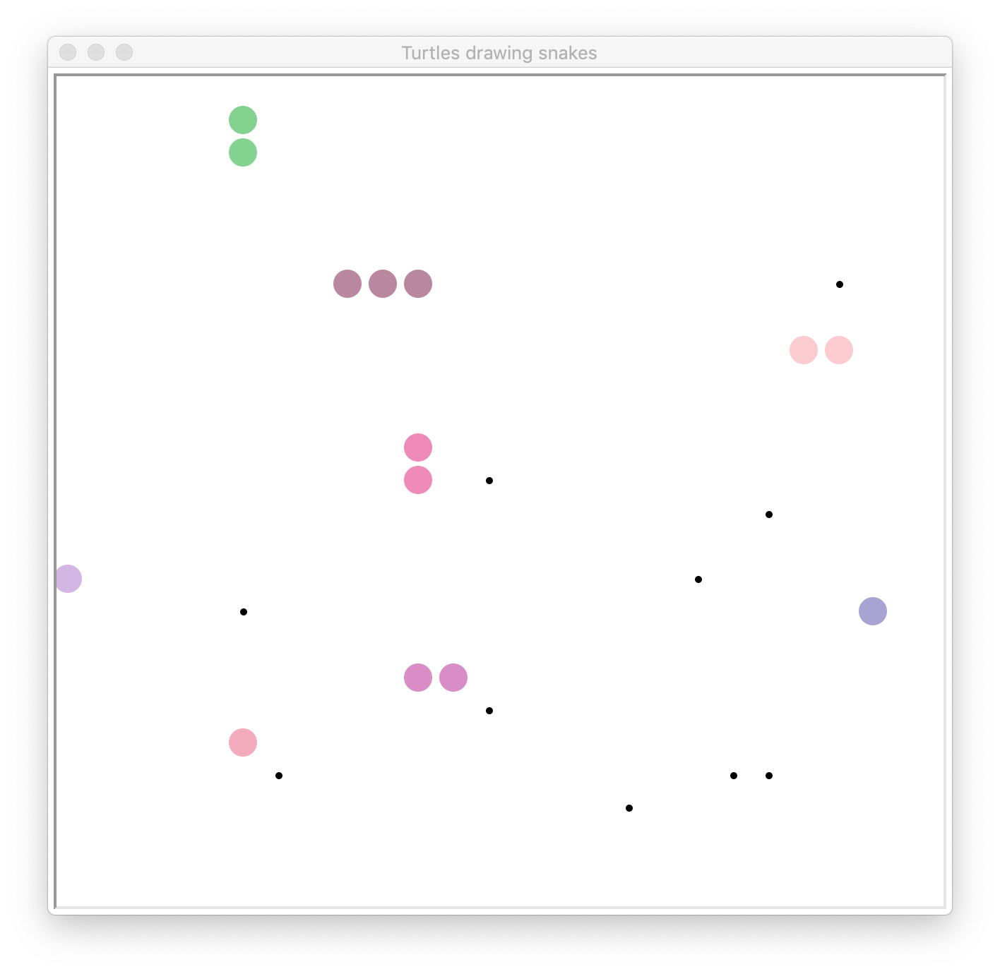

# MMSnake

MMSnake is short for Multiplayer-MQTT-based Snake.

## Starting

Enter `make run_engine` to start the server and `make console` to start an
example visualisation on the console. 

Other targets are specified in [Makefile](Makefile).

## Deploying

There is a [Dockerfile](docker/Dockerfile) that can be used to create
a container that runs an MQTT-Broker and allows for dynamically adding
new users that interact with the game engine. There is Javascript based
visualisation of the game as well. Once the container is started a web
interface is available on port 9090. The easiest way to accomplish
this is to run `make docker_container_start`.

### Configuration

The file [config.py](config.py) holds default values and documentation about 
configuration of the game.
